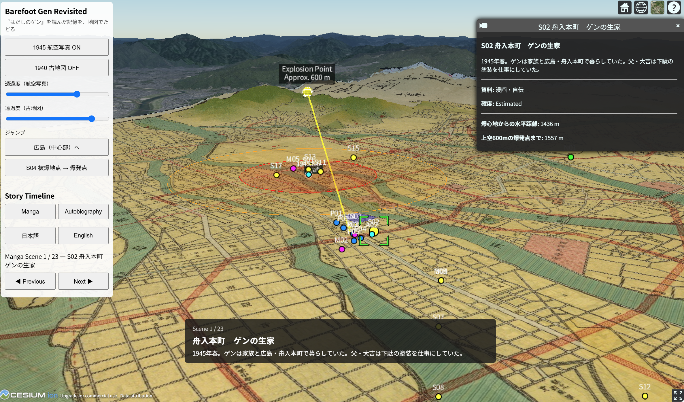

# Mapping the Distance to History

子どもの頃に『はだしのゲン』を読んだ私の記憶を、広島の地図上でたどるインタラクティブなアプリです。漫画の場面と中沢啓治の自伝を別々のタイムラインでたどり、1940年の古地図や戦後の航空写真を重ねて、物語に登場する場所と距離を考えます。被爆体験そのものを再現するものではなく、読書経験から歴史と土地への接近を試みる個人制作のプロジェクトです。

**[アプリを開く / Open the prototype](https://gen-kukita.github.io/hadashi-gen-cesium/)**

## Tracing My Memory of Reading *Barefoot Gen* with Open Geospatial Tools

This project was presented at FOSS4G Hiroshima 2026 on September 2, 2026. The interactive map traces my memory of reading Barefoot Gen through places in Hiroshima, alongside scenes from the manga and Keiji Nakazawa’s autobiography. Visitors can follow separate timelines over a 1940 historical map and postwar aerial imagery. This is a personal interpretation of a reading experience, not a reconstruction of survivors’ experiences.

The project uses CesiumJS, QGIS, historical maps, and aerial imagery to trace one reader’s memory of reading *Barefoot Gen* and to explore questions of place, distance, movement, narrative, and history.

## Independence and Disclaimer

This is an independent personal project by Gen Kukita. It is not an official project, statement, or position of Cesium, Bentley Systems, or any affiliated organization. CesiumJS is used here as a geospatial visualization technology.

本プロジェクトは、久木田弦個人による独立した活動です。Cesium、Bentley Systems、その他の所属・関係組織による公式プロジェクト、公式見解または立場を示すものではありません。CesiumJSは地理空間可視化技術として使用しています。

## Current Status

- CesiumJS prototype: [Live Prototype](https://gen-kukita.github.io/hadashi-gen-cesium/)
- Presentation PDF: [FOSS4G Hiroshima 2026 presentation deck](https://talks.osgeo.org/media/foss4g-2026/submissions/AL9L3W/resources/Cesium_SeminarDeck02_for_FOSS4G_Hir_5gumFLi.pdf)
- 1940 historical map: available online following confirmation with the International Research Center for Japanese Studies (Nichibunken)
- Source code: publicly available in this repository

## Historical Map

The 1940 historical map used in this application is based on *大廣島市街地圖 : 最新* (1940), held by the International Research Center for Japanese Studies (Nichibunken). See the [Nichibunken collection record](https://lapis.nichibun.ac.jp/chizu/map_detail.php?id=002445658). Its online publication in this project was confirmed with Nichibunken.

本アプリで使用している1940年の古地図は、国際日本文化研究センター（日文研）所蔵の『大廣島市街地圖 : 最新』を利用しています。[日文研の所蔵資料ページ](https://lapis.nichibun.ac.jp/chizu/map_detail.php?id=002445658)を参照してください。本プロジェクトでのウェブ公開については、日文研に確認済みです。

## Aerial Imagery

The 1945–1950 aerial imagery layer uses the Geospatial Information Authority of Japan (GSI) tile `ort_USA10`, loaded directly from the [GSI Tiles catalog](https://maps.gsi.go.jp/development/ichiran.html). The attribution “GSI Japan” is also provided in the application's imagery credits. This project has not established which individual photograph or exact acquisition date corresponds to each displayed tile.

1945～1950年の航空写真レイヤーには、国土地理院の[地理院タイル `ort_USA10`](https://maps.gsi.go.jp/development/ichiran.html)を使用し、国土地理院のサーバーから直接読み込んでいます。アプリの画像クレジットにも「GSI Japan」を設定しています。表示される各タイルと個別の原写真・正確な撮影日との対応は、本プロジェクトでは特定していません。

## About This Project

This is an unfinished interpretive mapping project created by one reader of *Barefoot Gen*. It is not intended as a complete reconstruction of the manga, Keiji Nakazawa’s life, or the experience of atomic-bomb survivors.

Location information is evaluated along two separate axes:

**Evidence confidence**

- High
- Medium
- Low
- Unknown

**Spatial precision**

- Exact
- Approximate
- General area
- Provisional
- Unknown

Evidence confidence indicates how strongly the available sources support the identification of a place. Spatial precision indicates how precisely that place can be positioned on the map.

## Contact

Gen Kukita  
gen.kukita.mapping@gmail.com
